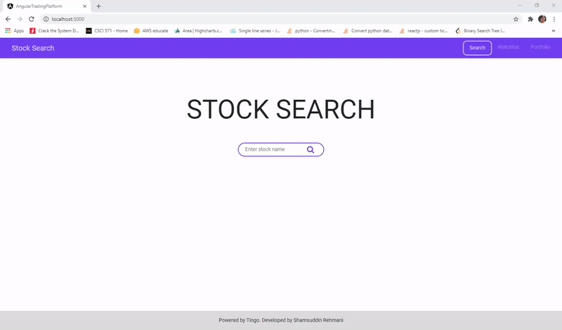

# Stocks Web Application
An Angular web application for virtual stock trading made as part of CSCI571 Web Technologies USC course

## Large Screen Demo


## Small Screen Demo


## Summary
This Angular app provides a platform for stocks trading, including, features such as searching company stock details, buying/selling stocks, keeping track of stock porfolio/watchlist, viewing stock price charts and news, allowing sharing news on twitter and facebook for a given stock. Express with Nodejs is used as a server proxy for all API calls that uses [Tingo API](https://api.tiingo.com/) for all stock related data, and [News API](https://newsapi.org/) for displaying stock related news. [Highcharts](https://www.highcharts.com/) is used for displaying the chart data for a given ticker.


## Usage
### Running the GCP deployed App:
* No longer supported but I have kept `app.yaml` file that was used for deployment

#### Note on dependencies
* I would recommend not to use this project as base to build new project since the dependencies (example Node and Angular) used for this project are all past the end of life maintenance cycle. However, if you still like to use it, then see below on how to set it up locally.


### Running the app Locally:
Before running make sure Nodejs version 12 is installed. To see if node is install or which version is currently installed, run
```
node --version
```

If you see something like ```v12.22.12```, then you are good to run the following commands shown below. If you do not have node version 12 installed, see the [Setup Node on Windows](####setup-node-on-windows) section before running the commands below. (I have just added instructions for Windows for now)


1. clone the repo
    ```
    git clone https://github.com/rehmanis/CSCI571-Stocks-Angular.git
    ```
2. go to the cloned repo
    ```
    cd CSCI571-Stocks-Angular
    ```
3. add the secret key values for `TINGO_API_KEY` and `NEWS_API_KEY` in the file [.env](.env) file. You will need to go to https://api.tiingo.com/, create an account and will find the token at https://api.tiingo.com/account/api/token. Add this to the value for `TINGO_API_KEY`. Do the same for getting the `NEWS_API_KEY`, i.e. go to https://newsapi.org/account, create an account, and then add this api key. Example your `.env` file should look like this once you have added the api keys
    ```
    TINGO_API_KEY=abcdefgh123456789
    NEWS_API_KEY=123456789abcdefgh
    ```


2. Install all dependencies (note make sure you are using node version 12 as stated earlier)
    ```
    npm install
    ```
3.  Build the angular frontend
    ```
    npm run-script ng build
    ```
4. Start server (runs both backend and frontend)
    ```
    npm run devstart
    ```
5. open ```Chrome``` or ```Firefox```. The App can then be started on ```http://localhost:3000/```


#### Setup Node on Windows
We will be using [nvm](https://github.com/coreybutler/nvm-windows) to manage/install the Node dependencies.
* Remove all existing NodeJS that was previously installed (you will need to go to control panel and uninstall NodeJs versions) and remove any folders related to NodeJS. See https://github.com/coreybutler/nvm-windows#installation--upgrades

* To install nvm, go to [latest release version](https://github.com/coreybutler/nvm-windows/releases), download the exe file and run the wizard.

* Once installed, run cmd/terminal as administrator and type `nvm` to make sure it installed corrected. To install node 12, run
    ```
    nvm install 12
    ```
* now if you run `nvm list` you should see node version 12 listed in the prompt output. To use node 12 run the following command
and in place of `<version>` add the version number that you saw from nvm list command for node 12
    ```
    nvm use <version>
    ```


### API endpoints
The following are the 6 API endpoints to get Stock data and News.
1. ```/api/detail/<ticker>```: get JSON object with company details/summary
    * Example for when running locally: http://localhost:3000/api/detail/msft

2. ```/api/price/<ticker1>,<ticker2>,...```: get JSON object with all companies prices points, volumes, etc.
    * Example for when running locally: http://localhost:3000/api/price/msft,amd,tsla
        
3. ```/api/chart/daily/<ticker>/<startDate:YYYY-MM-DD>```: get the JSON object that contains the timestamp, close price, high price, low price, and open price. This was used to display daily chart data.
    * Example for when running locally: http://localhost:3000/api/chart/daily/aapl/2020-12-02

4. ```/api/chart/historical/<ticker>```: get the JSON object that contains historical price data from last two years from now. This is used to plot the SMA chart
    * Example for when running locally: http://localhost:3000/api/chart/historical/tsla

5. ```/api/news/<search query>``` : get the JSON object that contains all news articles related to the searched query. The search query for this project is the ticker for the company. The articles are restricted to 20.
    * Example for when running locally: http://localhost:3000/api/news/amd

6. ```/api/search/<search query>```: get the JSON object for all search query. This is used for auto complete feature when searching for the ticker.
    * Example for when running locally: http://localhost:3000/api/search/warner

## License
MIT License

Copyright (c) 2020 Shamsuddin Rehmani

Permission is hereby granted, free of charge, to any person obtaining a copy
of this software and associated documentation files (the "Software"), to deal
in the Software without restriction, including without limitation the rights
to use, copy, modify, merge, publish, distribute, sublicense, and/or sell
copies of the Software, and to permit persons to whom the Software is
furnished to do so, subject to the following conditions:

The above copyright notice and this permission notice shall be included in all
copies or substantial portions of the Software.

THE SOFTWARE IS PROVIDED "AS IS", WITHOUT WARRANTY OF ANY KIND, EXPRESS OR
IMPLIED, INCLUDING BUT NOT LIMITED TO THE WARRANTIES OF MERCHANTABILITY,
FITNESS FOR A PARTICULAR PURPOSE AND NONINFRINGEMENT. IN NO EVENT SHALL THE
AUTHORS OR COPYRIGHT HOLDERS BE LIABLE FOR ANY CLAIM, DAMAGES OR OTHER
LIABILITY, WHETHER IN AN ACTION OF CONTRACT, TORT OR OTHERWISE, ARISING FROM,
OUT OF OR IN CONNECTION WITH THE SOFTWARE OR THE USE OR OTHER DEALINGS IN THE
SOFTWARE.
    
